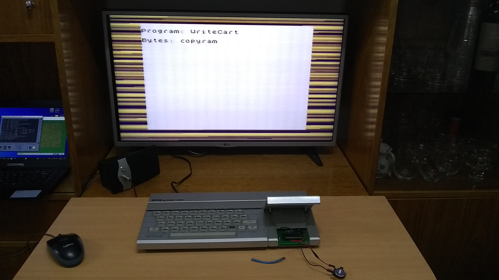
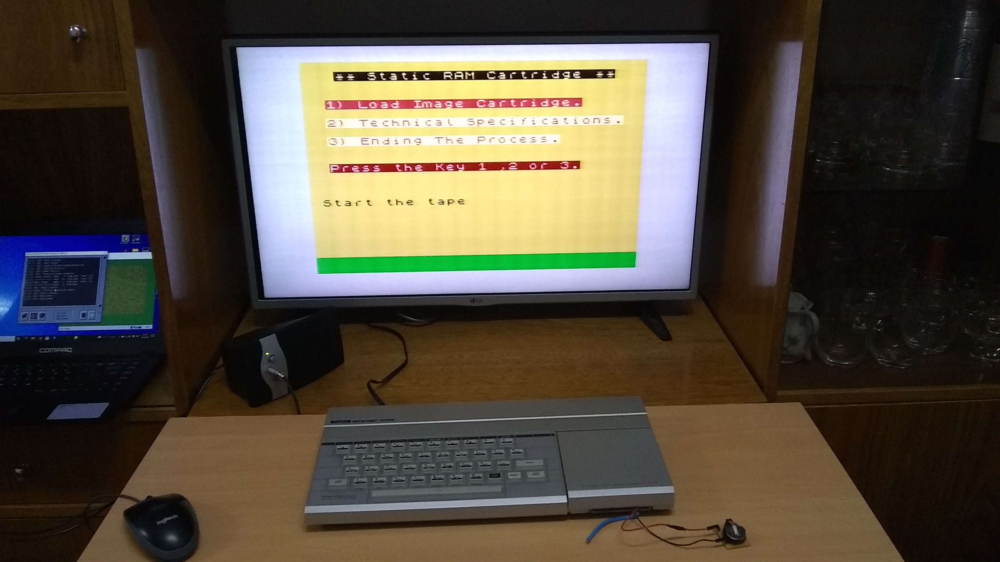
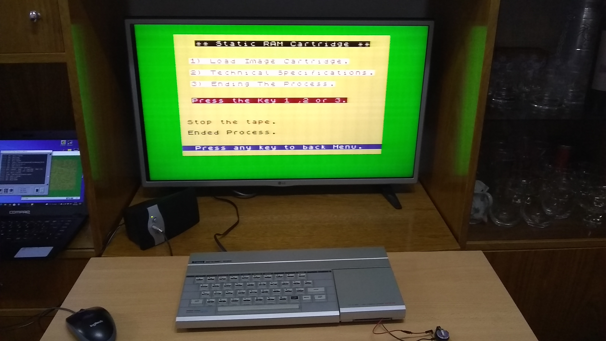
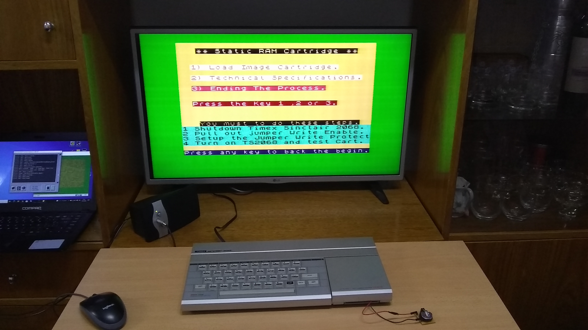

## 🔹 How to use the WriteCart program in TS2068 to create your own cartridges.

[Link How To on Youtube](https://www.youtube.com/watch?v=_XW6AfT9foQ)

### 🔸 Step 1. Load the file WriteCart.tzx in TS2068.

### 🔸 Step 2. Choice the option 1)

If the cartridge has the jumper in write-protect mode, change the jumper to the correct position.

### 🔸 Step 3. Load the file image TZX selected from the list. All these games are booting in AROS mode.

###### ◾ Choice some TZX files to load ,from Pack_Cart_SRAM.rar

### 🔸 Step 4. After to load the Game, the program will show this screen.

### 🔸 Step 5. Select option 3) and read and follow the instructions.

#### 🔺 WARNING: Always insert and eject the cartridge while the TS2068 is turn off. 

