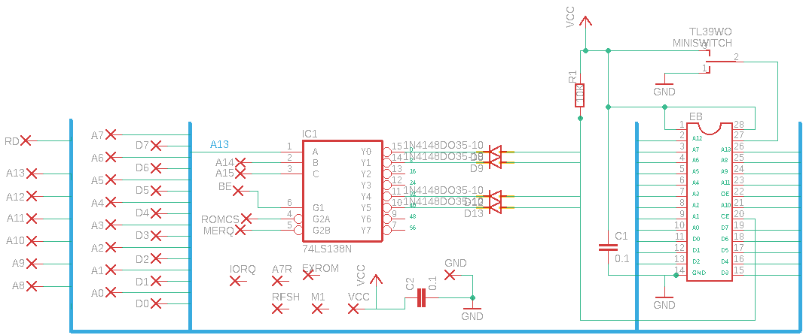
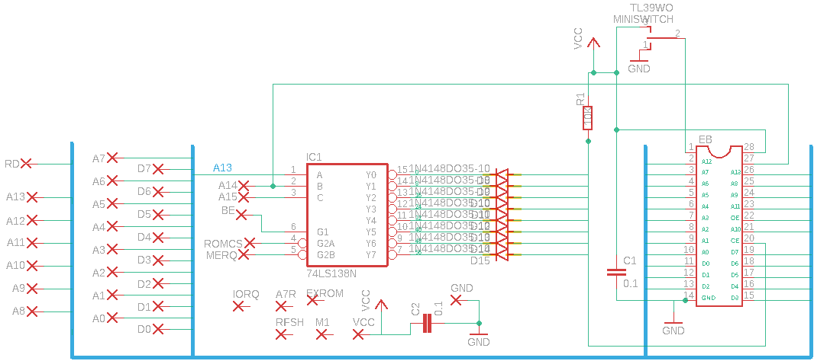
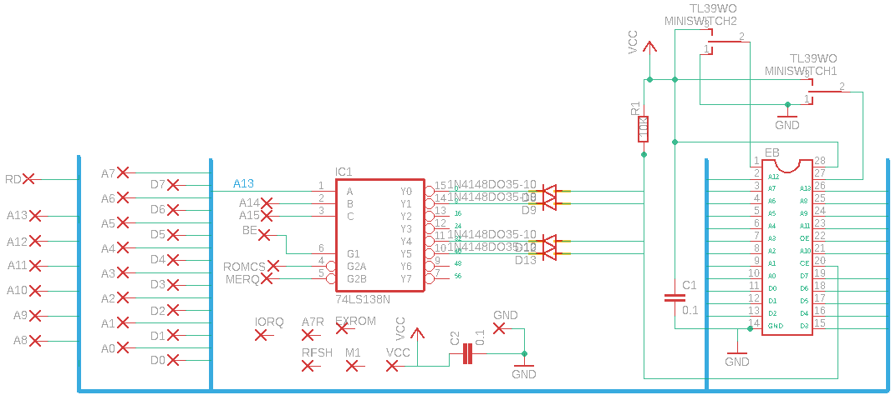
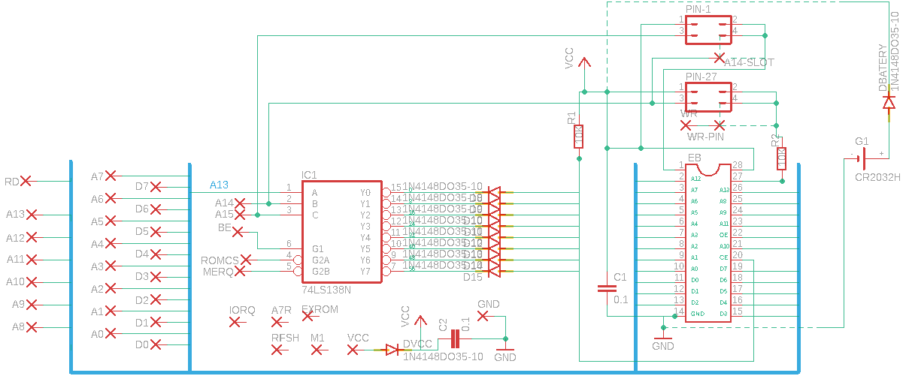

## 🔹 Files made with Eagle.

###### ◾  ARA_Cartridge_V4.sch

###### ◾  ARA_Cartridge_V4.brd

## 🔹 Cartridge scheme to replace jumpers using a switch and a jumper.

###### ◾ EPROM 27C256 divided into two equal parts 16K in size

###### ◾ EPROM 27C512 divided into two equal parts 32K in size

## 🔹 Cartridge scheme to replace jumpers using two switch.

###### ◾ EPROM 27C512 divided into four equal parts 16K in size

## 🔸 Cartridge scheme to use static ram and battery.

