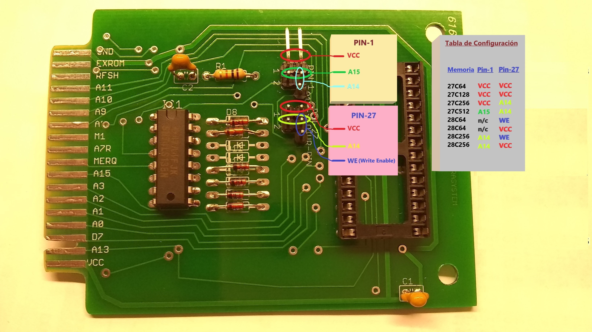

# Timex-Sinclair-2068-Cartridge-ARASYSTEM-V4-V5
This is a cartridge for Timex Sinclair 2068, to work with EPROMs 28C64, 27C128, 27C256, 27C512, EEPROMs 28C54, 28C256 and Static RAM 66256, 84256 and another with the same characteristics.  Using jumpers or mini switches, this PCB can be configured to get different settings.
With its unique design, there is no need to configure bridges to select fragments. The chunks can be configured for software.

## :small_blue_diamond: Jumpers configutation for each kind of EPROM /EEPROM

## :small_blue_diamond: Place right way to the socket the EPROM / EEPROM 

## 🔸 Watch the creation of the first cartridge on video
[Youtube Video Link](https://www.youtube.com/watch?v=S2ucEzxKyNs)

## 🔹 Cartridges With Mini Switches.
These mini switches allows to divide the EPROM memory into two or four parts, depending on the size of the EPROM (32k or 64K).

######  ▪️ ▪️ EPROM 27C256 divided into two 16K sizes

[See video example on Youtube](https://www.youtube.com/watch?v=SSa5LG2SbeI)

######  ▪️ ▪️ EPROM 27C512 divided into four 16K sizes

[See video example on Youtube](https://www.youtube.com/watch?v=w1bCyKRASG4)

# 🔹 Timex SInclair 2068 Cartridge With 32K Static RAM 
This cartridge is used to expand 32K of RAM and store your own programs or data, which are stored in memory through a 3 Volt battery. Both the cartridge board and the battery holder board have their protection diodes, so as not to interfere with the voltages between them.
Commercial programs that start in AROS mode can also be stored. (Only one game at a time, eg Flight Simulator, Androids, Crazy Bugs, Casino 1 and others).
this system is that they can generate / experiment cartridges, without the need for burners and / or ERPOM erasers.

[Demo on Youtube](https://www.youtube.com/watch?v=_XW6AfT9foQ)

# 🔸 License.

######  UNDER LICENSE: CC BY NC ND 4.0
- You may not use the material for commercial purposes.

<a rel="license" href="http://creativecommons.org/licenses/by-nc-nd/4.0/">Attribution-NonCommercial-NoDerivatives 4.0 International</a> 

## 🔹 You can get these cartridge on:
[eBay for All America](https://www.ebay.com/itm/313623907992?hash=item4905710e98:g:fuwAAOSw66dhBwh2)

[Mercado Libre for Argentina](https://listado.mercadolibre.com.ar/cartridge-timex-sinclair-2068#D[A:cartridge%20timex%20sinclair%202068%20])

