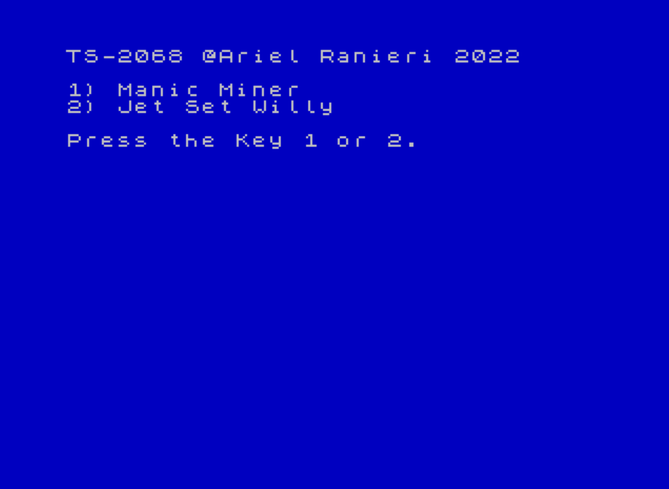

# 🔹 Software Pack Built for Timex Sinclair 2068 Cartridges.

I have made several sets of programs for these cartridges. All files have the .Dck extension. That is means you can run this files on some Emulator like FUSE or others. Remember to skip or delete the first nine bytes when you want to write the binary file to some EPROM.
In this section I'll focus on the others games (most of the Spectrum games) and skip the seven classic games made for cartridges on the TS2068.

You will see that in all projects, I am using the emulator FUSE for get Snap Shot files, and then I am using the "SnapToTap R2.3 (PC/Windows), by Arda Erdikmen" for to convert from Snap Shot files to TAP format  from 
this URL: [World Of Spectrum Utilities](https://worldofspectrum.net/utilities/)

The binary file can be created to start or boot in LORS mode [Cartridge Loader Maker:](https://www.retrocomputacion.com/forum/hardware_s/108010/eproms-para-las-plaquetas-timex-sinclair-2068-command-cartridge-v2/&p=7), or in AROS mode  [Cartridge Maker AROS V2:](https://www.retrocomputacion.com/forum/hardware_s/108010/eproms-para-las-plaquetas-timex-sinclair-2068-command-cartridge-v2/&p=8)
Both web pages (they are in Spanish) explain how to do it.

## 🔹 Start in Mode LROS EEPROM 28C256 or EPROM 27C256.

The steps for make cartridges booting in LORS mode are:
1) From the FUSE Emulator in TS2068 mode, Load a program TZX or TAP file and then Create a Snap Shot file and save it on disk.
2) Convert Snap Shot file to .TAP .
3) Again From the FUSE program, load the "Cartridge Loader Maker" software and get the binary file.
4) Burn the binary file on the eprom.

## 🔹 Start in Mode AROS EEPROM 28C256 or EPROM 27C256.

The steps for make cartridges booting in AORS mode are:
1) From the FUSE Emulator in TS2068 mode, load a program TZX or TAP file and then Create a Snap Shot file and save it on disk.
2) Convert Snap Shot file to .TAP .
3) Again From the FUSE program, load the "Cartridge Maker AROS V2" software and get the binary file.
4) Burn the binary file on the eprom.

## 🔹 Start in Mode AROS With Menu from EPROM 27C512.
Make cartridges with two Games. The steps to do are:
Instructions for creating a Basic Menu To select two SnapShot programs. (Use the FUSE Emulator Program in TS2068 mode).

1) Create a snapshot for cartridge with LROS boot.
2) Create a Snap Shot for Cartridge with AROS boot.
3) Eraase the boot LROS mode(put 0 from the second byte to fourth byte in the file) and save it.
4) Change the boot AROS mode to AROS Basic (put 1 on the first byte in the file) and save it.
5) From the FUSE Emulator in TS2068 mode, load the Program Menu_Basic_AROS.tzx file, then edit line 5 and write the names of the programs. The first program "1)",    executes the snapshot prepared to boot type LROS. The second program "2)", executes the snapshot, ready to start type AROS.
6) Save from the FUSE in binary format with file name menu_basic_LORS_AROS.bin, as Start = 26710 , Length = 320.
7) Load the binary file (created in the item 2) from memory address 32768 an then load the other binary file menu_snap_LROS_AROS.bin from the FUSE, with the Start    parameter = 32776, and Length the one indicated by the size of the binary file (320 bytes, it must not exceed this size as described above).

8) Load the binary file headerAros.bin from the FUSE, with the parameter Start = 33096, and Length the one indicated by the size of the binary file (168 , respect this size).
9) Save from the FUSE the program in binary format as Start = 32768 and length = 32768.
10) Concatenate with the DOS COPY command, the two binary files to burn them on 27C512 EPROM (Using for example the Xgpro TL866II PLUS program). 
    copy /b CARTRIDGE_SMAP_LROS.bin+CARTRIDGE_SMAP_AROS.bin MI_CARTRIDGE_FINAL.bin .
11) If you want to test it in the Fuse emulator, we add the 9 Bytes header (0-2-2- 2-2-2-2-2-2) 
    copy /b Header_DOCK.bin+MI_CARTRIDGE_FINAL.bin Cartridge.dck 
    
### 🔸 Videos Youtube
[Cartridge: Manic Minier and Jet Set Willy](https://www.youtube.com/watch?v=gIqrhjyPwj8)

[Cartridge: ROM ZX Spectrum and Poe Position](https://www.youtube.com/watch?v=1JByrzgxnWw)

## 🔹 Built to lung and using too much the wrist.
This is the hardest way to build cartridges that boot the programs from any Dock Bank memory address.
The 7Games9K.DCK (7 Games 9K bytes) and 8Games8K.DCK (8 Games 8K bytes) files are more complicated to build. It is necessary to make an installer for each of the games and place them in the best place in the eprom (27C512). And play with the eight 8Kbyte chunks, the Stack Point and other environments.

### 🔸 Videos Youtube
[Cartridge: 7 Games of 9Kbytes](https://www.youtube.com/watch?v=phbGwPkzN14)

[Cartridge 8 Games of 8Kbytes](https://www.youtube.com/watch?v=hWecyYZo_lU)
